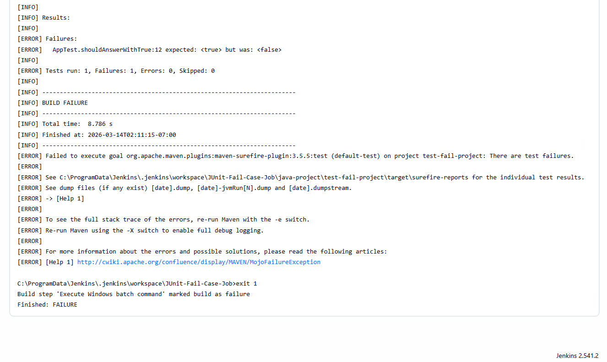

# test-fail-project

[한국어](README_ko.md) | English

## Project Purpose

This is a test project created to verify whether test failures are properly propagated to the overall Jenkins build status when running `mvnw clean test` using `C:\Windows\SysWOW64\cmd.exe /c` in Jenkins' **Execute Windows batch command** build step.

## Verification Scenario

- **✨ Set up a Jenkins Freestyle Job in Jenkins running as SYSTEM account.**

- Specify the cmd.exe used in the Jenkins Freestyle project's **Execute Windows batch command** step to the x86 environment path below.

- Enter the following command in the build step:

  ```bat
  C:\Windows\SysWOW64\cmd.exe /c mvnw clean test
  ```

- The project contains tests that are intentionally written to fail, and this verifies whether the Jenkins build is marked as `FAILURE`.

## Expected Behavior

- When tests fail, the Jenkins Job should be marked as **FAILURE**.

> **Note:** `C:\Windows\SysWOW64\cmd.exe` is the cmd.exe that runs 32-bit (x86) processes on 64-bit Windows.
> The standard 64-bit cmd is `C:\Windows\System32\cmd.exe`, and you can verify whether there are behavioral differences between the two environments.

## Project Configuration

- **✨ Set up a Jenkins Freestyle Job in Jenkins running as SYSTEM account.**
- **Java 17 - x86**
- **JUnit Jupiter (JUnit 6)**
- Uses Maven Wrapper (`mvnw`)


## Verification Result (Failure propagation works well even when wrapped with `cmd /c`. 😅)


