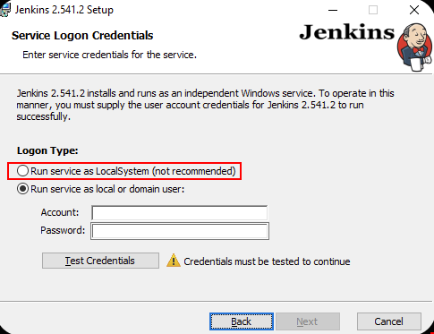

# Jenkins에서 실제 동작 테스트

>  Windows Server 2022 180일 평가판에 Jenkins 2.541.2를 설치해서 동작을 확인해보았습니다.


## Jenkins 설정 준비

### ✨ 로그인 타입

Run service as LocalSystem을 설정해야 SYSTEM 계정으로 Job이 실행된다.



### ✨ Jenkins 자체를 실행하는 JDK도 x86 JDK여야한다.

Jenkins 자체를 실행하는 JDK 설정이 x64일 경우.. x86 JDK를 설정해서 빌드를 할 때, Maven Wrapper가 필요한 클래스를 못찾는 문제가 있다. 그래서 Jenkins 자체를 실행하는 JDK도 x86 JDK로 설정해줘야한다.

이미 x64 JDK로 설정한 상태라면...

* `C:\Program Files\Jenkins\jenkins.xml` 파일에서 ...

  ```xml
  <service>
    ...
    <executable>C:\JDK\JDK17_x86\latest\bin\java.exe</executable>
    ...
  ```

  위의 JDK 설정 부분을 바꾸고 Jenkins를 재시작 해준다.

  위의 예시에서는 x86 JDK 17로 변경해두었음.


## 실행 테스트

### Toolchain 설정

이 내용은 테스트할 Java 빌드 테스트 프로젝트가 ToolChain 설정이 되어있어서...

* `C:\Windows\SysWOW64\config\systemprofile\.m2` 이하에 `toolchains.xml`을 만들어둬야한다. 😅

  ```xml
  <?xml version="1.0" encoding="UTF-8"?>
  <toolchains>
    <toolchain>
      <type>jdk</type>
      <provides>
        <version>17</version>
        <vendor>temurin</vendor>
      </provides>
      <configuration>
        <jdkHome>C:/JDK/JDK17_x86/latest</jdkHome>
      </configuration>
    </toolchain>
  </toolchains>
  ```

  

## 테스트 Job 설정

FreeStyle 프로젝트로 생성하고 GitHub에서 테스트할 프로젝트를 받아서 mvnw clean test 를 실행하는 단순한 Job을 만든다.

* Git 설정

  * https://github.com/fp024/spring-mvc-practice-study/
  * 브랜치: **jenkins-jdk-x86-test**

* Build Steps에다 Execute Windows batch command 추가해서 다음 명령 설정

  ```cmd
  mvnw clean test
  ```


### 실행결과

```
Started by user fp024
Running as SYSTEM
Building in workspace C:\ProgramData\Jenkins\.jenkins\workspace\Java Build Test
The recommended git tool is: NONE
...
...
[Java Build Test] $ cmd /c call C:\Windows\TEMP\jenkins13618979669008619938.bat

C:\ProgramData\Jenkins\.jenkins\workspace\Java Build Test>mvnw clean test 
icm : Cannot index into a null array.
At line:1 char:97
+ ... 'mvnw.cmd'; icm -ScriptBlock ([Scriptblock]::Create((Get-Content -Raw ...
+                 ~~~~~~~~~~~~~~~~~~~~~~~~~~~~~~~~~~~~~~~~~~~~~~~~~~~~~~~~~
    + CategoryInfo          : InvalidOperation: (:) [Invoke-Command], RuntimeException
    + FullyQualifiedErrorId : NullArray,Microsoft.PowerShell.Commands.InvokeCommandCommand
 
Cannot start maven from wrapper  
Build step 'Execute Windows batch command' marked build as failure
Finished: FAILURE
```

✨ 이슈 올리신 분 내용 처럼, **Cannot index into a null array. 오류가 발생함을 확인.** ✨


### mvnw.cmd를 수정한 브랜치로 Job을 새로 만들어 실행

* Git 설정
  * https://github.com/fp024/spring-mvc-practice-study/
  * 브랜치: **master**

### 실행결과

```
Started by user fp024
Running as SYSTEM
Building in workspace C:\ProgramData\Jenkins\.jenkins\workspace\Java Build Test - fix
...
...
[Java Build Test - fix] $ cmd /c call C:\Windows\TEMP\jenkins4397049118303502916.bat

C:\ProgramData\Jenkins\.jenkins\workspace\Java Build Test - fix>mvnw clean test 
[INFO] Scanning for projects...
[INFO] 
[INFO] ----------< org.fp024.mvcpractice:spring-mvc-practice-study >-----------
[INFO] Building spring-mvc-practice-study 1.0.0-SNAPSHOT
[INFO]   from pom.xml
[INFO] --------------------------------[ war ]---------------------------------
[INFO] 
[INFO] --- clean:3.5.0:clean (default-clean) @ spring-mvc-practice-study ---
...
...
[INFO] Tests run: 1, Failures: 0, Errors: 0, Skipped: 0, Time elapsed: 1.978 s -- in org.fp024.mvcpractice.HomeControllerTests
[INFO] 
[INFO] Results:
[INFO] 
[INFO] Tests run: 2, Failures: 0, Errors: 0, Skipped: 0
[INFO] 
[INFO] ------------------------------------------------------------------------
[INFO] BUILD SUCCESS
[INFO] ------------------------------------------------------------------------
[INFO] Total time:  10.264 s
[INFO] Finished at: 2026-03-11T14:52:18-07:00
[INFO] ------------------------------------------------------------------------
Finished: SUCCESS
```

정상 수행이 확인됨.

**SysWOW64**이하의 `.m2\wrapper\dists` 경로에도 maven이 정상 다운로드 되어있음을 확인하였다.

```
C:\Windows\SysWOW64\config\systemprofile\.m2\wrapper\dists>dir
 Volume in drive C is SDT_x64FREE_EN-US_VHD
 Volume Serial Number is 88CF-9A7A

 Directory of C:\Windows\SysWOW64\config\systemprofile\.m2\wrapper\dists

2026-03-11  오후 02:52    <DIR>          .
2026-03-11  오후 02:52    <DIR>          ..
2026-03-11  오후 02:52    <DIR>          apache-maven-3.9.12
               0 File(s)              0 bytes
               3 Dir(s)  25,909,067,776 bytes free

C:\Windows\SysWOW64\config\systemprofile\.m2\wrapper\dists>
```

